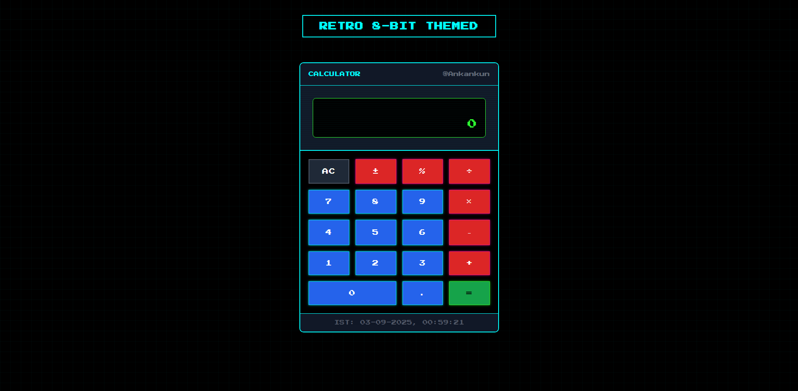
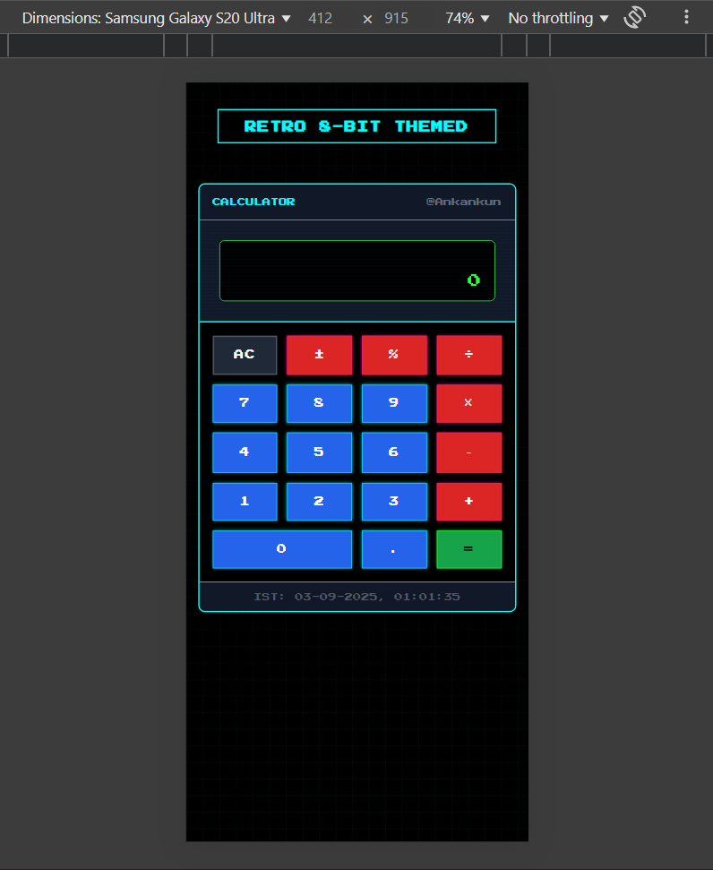

## 🎮 Retro 8‑Bit Calculator (HTML + CSS + JS)

Simple neon / pixel styled calculator you can open by just double‑clicking `index.html`. No build tools, no frameworks.

> Goal: look cool, stay readable, be easy to explain in an interview.

### � Preview

Desktop view:



Mobile view:



> If these images don't show up yet, just grab a screenshot of the running page (one wide, one narrow ~390px) and save them in the project root with those file names.

### �🔥 What It Does

- Basic math: + − × ÷
- Extra: percent %, change sign (±), clear (AC)
- Decimal numbers
- Keyboard support (0‑9 . + - \* / Enter = Esc)
- Shows the full operation when you press =
- Live IST clock at the bottom
- Mobile friendly (shrinks buttons on very narrow screens)

### 🧠 How The Logic Works

State variables in `script.js`:

```
current   -> string shown on the green main display (starts '0')
previous  -> stored number after you pick an operator
operator  -> '+', '-', '*', '/' (null when none selected)
justCalculated -> true right after '=' so next number replaces result
```

Flow:

1. Press numbers -> they append to `current` (unless we just finished a calc).
2. Press an operator -> move `current` into `previous`, store operator, reset `current` to '0'.
3. Press more numbers -> build second number.
4. Press '=' -> compute with `previous` + `operator` + `current`, show result, clear `previous` + `operator`, flag `justCalculated`.
5. Chain operations: if you press another operator instead of '=', we quickly run `equals()` then continue.
6. Percent = divide `current` by 100. Sign = toggle leading `-`.
7. Divide by zero -> shows `ERR` (very basic error handling).

Formatting helper: `trimResult()` keeps numbers from overflowing by shortening long outputs or using scientific notation for huge values.

### 🖱 Keyboard Shortcuts

| Key        | Action        |
| ---------- | ------------- |
| 0‑9        | Digits        |
| .          | Decimal point |
| + - \* /   | Operators     |
| Enter or = | Equals        |
| Esc        | AC (clear)    |

### 🎨 Styling Notes

- Only simple color variables kept (easier to tweak). Removed spacing & font size CSS variables to look less “tool generated”.
- Pixel font: Google Fonts `Press Start 2P`.
- Scanline effect: a pseudo element with a repeating linear gradient.
- Neon glow: stacked box‑shadows around buttons.
- Layout: plain CSS Grid for buttons (`repeat(4, 1fr)`), no frameworks.

### 📱 Mobile Behavior

- Container width capped at 384px (classic small handheld size feel).
- At < 360px screen width: smaller font + smaller button padding.

### ✅ Possible Improvements

- Memory keys (M+, M-, MR, MC)
- Backspace (delete last digit)
- History panel
- Better error handling (flash screen, etc.)
- Limit significant digits more intelligently
- Theme toggle (bright vs dark neon)

### ⏰ IST Clock

Updated every second. Uses `toLocaleString` with `timeZone:'Asia/Kolkata'` so it shows IST regardless of the user’s local machine timezone.

---

Enjoy hacking it. Tweak colors, break it, fix it, learn it. Retro vibe unlocked. 😎
